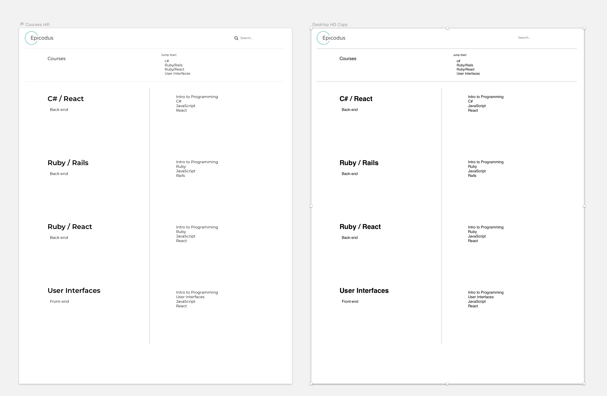
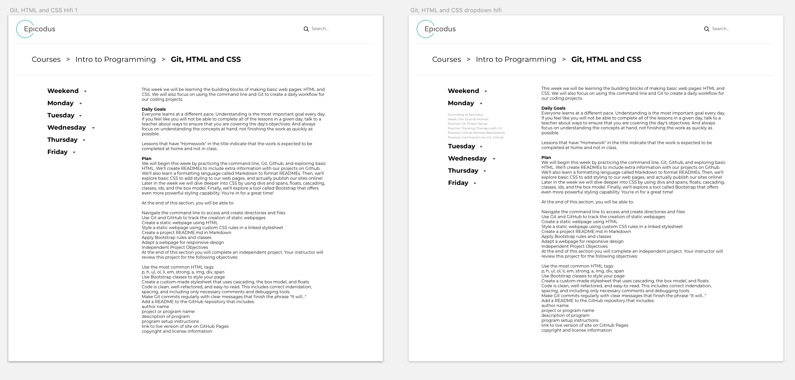
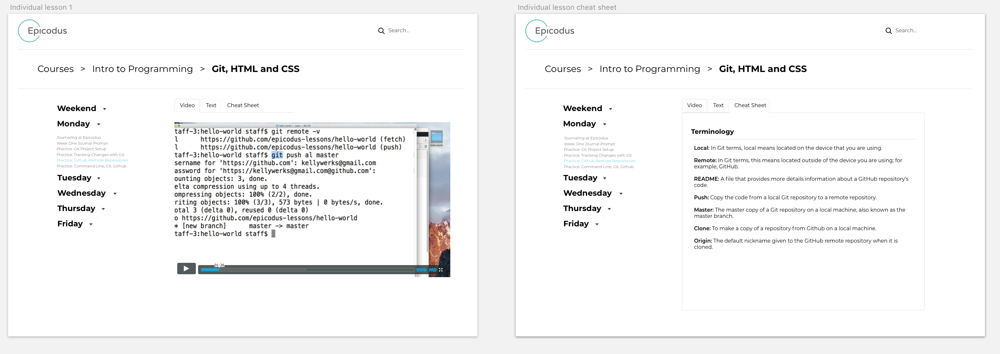

## Epicodus - Learn How to Program 2.0
---

#### Krystal Foster and Nikki Wong
#### Sep. 12, 2018

### Description

This website adds a more fluid workflow to the original website's navigation and layout.

### Images

Screenshots of your Sketch wireframes should go here. Make sure to include all versions (if you have different mobile, tablet, desktop, etc.) designs. Use Dropbox or another free image hosting service to host your images.

#### Desktop Version

#### Mobile Version

### User Stories

* We'll  
* Learn
* About
* These
* Monday
* Night

### Technologies and Resources

* Bootstrap
* jQuery
* Sass
* Sketch

### Responsiveness

This project is responsive. Content dimensions adjust based on viewport.

### Setup Instructions

Describe how someone can clone and launch this project.

### Roadmap

We would have liked to add a search function but we don't know how yet.

### License

Determine the license under which this application can be used.

Copyright (c) 2018 **_{ Krystal Foster, Nikki Wong}_**
